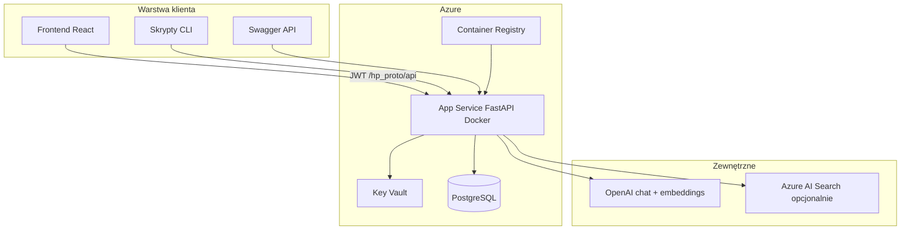
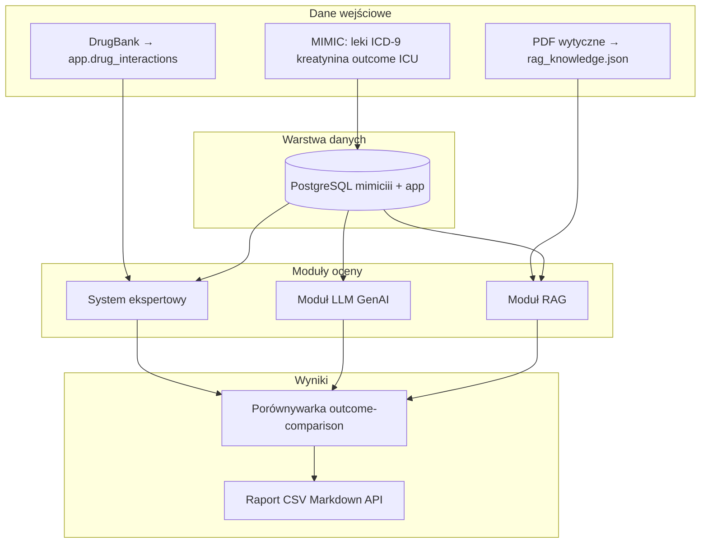

# Architektura HealthcareProto

Opis samowystarczalny — bez konieczności „domyślania się z aplikacji”.

## Cel

Informatyczna platforma **monitorowania i oceny bezpieczeństwa leków przeciwarytmicznych** (Vaughan-Williams I/III) u pacjentów z chorobami układu krążenia. Porównuje trzy podejścia decyzyjne względem danych MIMIC-III i umożliwia chat kliniczny (LLM / RAG).

---

## Widok wysokiego poziomu

---

## Przepływ oceny pacjenta MIMIC

---

## 1. Dane wejściowe

| Źródło | Zawartość | Użycie |
|--------|-----------|--------|
| **MIMIC-III** (`mimiciii.*`) | leki, ICD-9, kreatynina→eGFR, zgon, ICU, LOS | kohorta kardiologiczna, outcome warstwa A |
| **App** (`app.*`) | profile pacjentów, dokumenty, chat, użytkownicy | monitoring kliniczny, RAG dokumentów |
| **Wytyczne** (`artifacts/rag_knowledge.json`) | chunki PDF (ESC itd.) | retrieval RAG |
| **DrugBank** (`app.drug_interactions`) | interakcje par leków | reguła `DatabaseDrugInteractionRule` |

**Kohorta:** pacjenci z ICD-9 426*, 428*, 42731, 42732, 4271, 2768 (`get_heart_patients`).  
**Skala demo:** ~100 pacjentów MIMIC-III Demo w PostgreSQL.

---

## 2. Warstwa danych

PostgreSQL, dwa schematy:

| Schemat | Tabele (przykłady) | Rola |
|---------|-------------------|------|
| `mimiciii.*` | patients, admissions, prescriptions, labevents, icustays, diagnoses_icd | read-only MIMIC |
| `app.*` | users, patient_profiles, med_documents, chat, drug_interactions | aplikacja |

Import MIMIC: [`scripts/seed_mimic_data.py`](../scripts/seed_mimic_data.py).

---

## 3. Moduł ekspercki

- Lokalizacja: [`expert_system/`](../expert_system/)
- Silnik: [`RuleEngine`](../expert_system/engine/rule_engine.py) — reguły ładowane przy starcie
- Reguły: renal (eGFR), interakcje QT/CYP/beta-bloker, DrugBank, przeciwwskazania renalne antyarytmików
- Wyjście: `DecisionContext` — alerty, `contraindicated`, `risk_score`, dose adjustment

---

## 4. Moduł LLM (GenAI)

- Lokalizacja: [`PipelineService._approach_genai`](../api/services/pipeline_service.py)
- Model: OpenAI (`AIModelService`)
- Wejście: `PatientContext` sformatowany jako prompt
- Wyjście: odpowiedź tekstowa + `SAFETY_VERDICT: HIGH_RISK|LOW_RISK`
- **Bez** retrievalu wytycznych

---

## 5. Moduł RAG

- Lokalizacja: [`api/rag_store.py`](../api/rag_store.py) (+ opcjonalnie [`api/rag_search_store.py`](../api/rag_search_store.py))
- Backend: `RAG_BACKEND=memory` (dev) lub `azure_search` (prod)
- Retrieval: wytyczne + opcjonalnie dokumenty pacjenta (`app.med_documents`)
- Pipeline: expert alerts → RAG context → LLM z werdyktem
- Wyjście: odpowiedź + `rag_sources` (filename, score)

Seed wytycznych: [`scripts/seed_rag_knowledge.py`](../scripts/seed_rag_knowledge.py).

---

## 6. Porównywarka wyników

- Serwis: [`OutcomeComparisonService`](../api/services/outcome_comparison_service.py)
- Endpoint: `GET /hp_proto/api/pipeline/outcome-comparison`
- Raportuje: sygnały expert/GenAI/RAG, outcome MIMIC (A), proxy (B), ICU/LOS, zgodność między modelami
- **Bez** F1 / precision / recall — patrz [`study_example/METHODOLOGY.md`](../study_example/METHODOLOGY.md)

Skrypt CLI: [`scripts/run_comparison.py`](../scripts/run_comparison.py).

---

## 7. Frontend (osobne repozytorium)

Integracja przez [`FRONTEND_API.md`](../FRONTEND_API.md):

| Ekran | Endpoint |
|-------|----------|
| Login | `POST /auth/login` |
| Pacjenci + MIMIC | `/patients`, `PUT /patients/{id}/mimic` |
| Chat LLM/RAG | `POST /chats/send` |
| Comparison | `GET /pipeline/outcome-comparison` |

---

## 8. Warstwa API (backend)

| Warstwa | Katalog | Rola |
|---------|---------|------|
| Routes | [`api/routes/`](../api/routes/) | HTTP, auth JWT |
| Services | [`api/services/`](../api/services/) | logika biznesowa |
| Schemas | [`models/schemas/`](../models/schemas/) | Pydantic |
| ORM | [`api/models.py`](../api/models.py) | SQLAlchemy |

Entry point: [`api/app.py`](../api/app.py) — prefix `/hp_proto/api`.

Startup: DB schemas, RAG init, DrugBank cache, sync dokumentów pacjenta.

---

## 9. Azure (wdrożenie)

| Komponent | Usługa |
|-----------|--------|
| API | App Service (Docker z ACR) |
| Baza | Azure Database for PostgreSQL |
| Sekrety | Key Vault (`db-url`, OpenAI, opcjonalnie Search) |
| RAG prod | Azure AI Search (BYO vectors) |
| LLM | OpenAI API |

Szczegóły: [`AZURE_DEPLOYMENT.md`](../AZURE_DEPLOYMENT.md).

---

## 10. Skrypty badawcze

| Skrypt | Rola |
|--------|------|
| `run_comparison.py` | batch outcome-comparison → CSV/Markdown |
| `run_pilot.py` | pilotaż 100 pac. → `artifacts/pilot_100.csv` |
| `select_case_studies.py` | 5–10 case studies z pilotażu |

---

## Powiązane dokumenty

- [`study_example/SAFETY_DEFINITION.md`](../study_example/SAFETY_DEFINITION.md) — definicja parametrów
- [`study_example/METHODOLOGY.md`](../study_example/METHODOLOGY.md) — metodologia eksperymentu
- [`study_example/THESIS_DRAFT.md`](../study_example/THESIS_DRAFT.md) — szkielet rozdziałów pracy
